# UltraYield V2 fee mechanics

## Scope and terminology

This document is the fee specification for `UltraYieldV2FeeCollector` and the fee-relevant code it depends on:

- `UltraYieldV2FeeCollector`, which adds the UltraYield V2 async and instant exit flows;
- `CuratedFeeCollectorBase`, which owns partner-fee configuration, deposits, positions, and fee settlement;
- `FeeMath`, which defines partner-fee arithmetic and rounding;
- the selected UltraYield V2 `AllowlistUltraVault`/`UltraVault`, including its native management, performance,
  withdrawal, and instant-redeem fees;
- OpenZeppelin `Math`, `SafeERC20`, `Ownable2Step`, `Pausable`, and `ReentrancyGuard` where they affect fee
  calculation, movement, or administration.

The collector is deployment-address agnostic. Its constructor accepts an UltraYield V2 vault proxy; it does not
hardcode either the current production proxy or the `AllowlistUltraVault` test deployment. References to the live
fork in this document describe integration evidence, not a constructor restriction.

The word **partner** means the wallet or custody platform configured in the collector. **Native fee recipient**
means the independent recipient configured in UltraYield. **Gross from vault** means the assets actually returned
to the collector by UltraYield; for both exit routes this is already net of UltraYield's applicable asset fee.

## The two independent fee layers

There are two deliberately stacked fee systems. They have different owners, recipients, clocks, rounding rules,
and payment forms.

| Layer | Fee | Base | When realized | Recipient | Form |
|---|---|---|---|---|---|
| Collector | Deposit | User's input assets | Deposit | Current partner | Underlying asset |
| Collector | Withdrawal | Assets actually returned by UltraYield | Claim or instant redeem | Current partner | Underlying asset |
| Collector | AUM | Assets actually returned by UltraYield × elapsed blocks | Claim or instant redeem | Current partner | Underlying asset |
| UltraYield | Management | Snapshot of total vault assets × elapsed seconds | Native fee collection | Native fee recipient | Newly minted vault shares |
| UltraYield | Performance | Gain over high-water mark × total shares | Native fee collection | Native fee recipient | Newly minted vault shares |
| UltraYield | Withdrawal | Gross asset value of redeemed shares | Async fulfillment or instant redeem | Native fee recipient | Requested asset |
| UltraYield | Instant premium | Gross asset value of instantly redeemed shares | Instant redeem only | Native fee recipient | Requested asset |

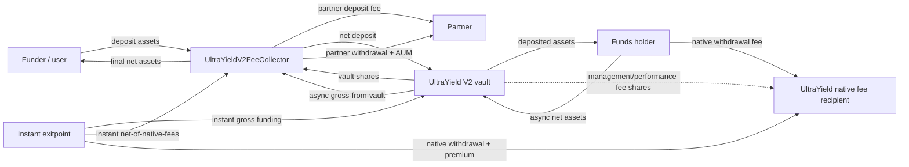

The collector never receives or redistributes UltraYield's native fees. UltraYield never knows the collector's
individual end users or partner-fee rates. UltraYield sees one pooled share owner and redemption controller: the
collector.

## Actors, custody, and trust boundaries

| Actor | Fee-relevant authority or responsibility |
|---|---|
| User/funder | Approves and supplies assets; may deposit for an allowed beneficiary; may request, claim, or instantly exit their own internal position. |
| Beneficiary | Owns a non-transferable position in the collector's ledger. Receives all final net exit assets. |
| Partner | Receives collector fees and may call the explicit `*For` exit methods. Cannot choose another principal recipient. |
| Collector owner | Can change all collector fee rates, change the partner, pause/unpause deposits, and transfer ownership through `Ownable2Step`. |
| Collector | Custodies all real vault shares, attributes them to users internally, and performs the partner fee split. |
| UltraYield owner | Controls UltraYield native fee rates and native fee recipient, subject to UltraYield caps. |
| UltraYield operator | Fulfills async redemption requests and therefore crystallizes the native async withdrawal fee. |
| Funds holder | Receives net deposits and supplies async redemption assets plus the native withdrawal fee. |
| Instant exitpoint | Supplies both the user's instant proceeds and UltraYield's instant asset fee. |
| Allowlist administrator | Onboards the collector and users. Fee-share mints also require a valid native fee recipient under `AllowlistUltraVault`. |

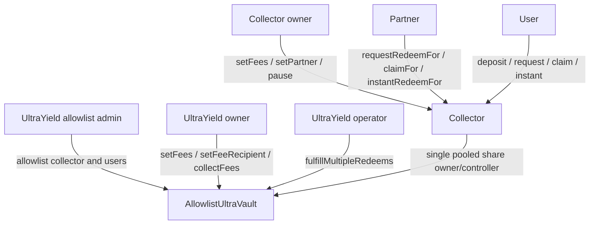

One collector instance is intended to serve many end users. It is not one instance per user. Users receive no
transferable receipt token: the actual UltraYield shares stay in the collector, while `s_positions[user]` and
`s_pending[user]` provide the user-level accounting.

## Units, scales, caps, and rounding

### Collector rates

| Parameter | Scale | Hard cap | Interpretation |
|---|---:|---:|---|
| `depositFeeBps` | 10,000 = 100% | 500 = 5% | One-time percentage of input assets |
| `withdrawalFeeBps` | 10,000 = 100% | 500 = 5% | Percentage of assets returned by UltraYield |
| `aumFeePerBlock` | 1e18 = 100% per block | 1e12 | Fraction charged for each elapsed block |

`MAX_AUM_FEE_PER_BLOCK = 1e12` is `0.0001%` per block. It is a per-block safety cap, not an annualized percentage.
The effective raw AUM fraction is `aumFeePerBlock × blocksElapsed / 1e18` and can exceed 100% over a sufficiently
long interval; settlement clamps the AUM fee to the assets left after the withdrawal fee.

All collector fee calculations round **up** to the smallest unit of the underlying asset:

```text
depositFee    = ceil(assetsIn × depositFeeBps / 10,000)
withdrawalFee = ceil(grossFromVault × withdrawalFeeBps / 10,000)
aumFeeRaw     = ceil(grossFromVault × aumFeePerBlock × blocksElapsed / 1e18)
aumFee        = min(aumFeeRaw, grossFromVault - withdrawalFee)
netToUser     = grossFromVault - withdrawalFee - aumFee
```

The zero cases are explicit: a zero amount, zero rate, or (for AUM) zero elapsed blocks produces zero. Otherwise,
even a positive fraction below one token unit rounds to one smallest unit. For example, 30 bps of 333 units is
0.999 units and is charged as 1 unit.

`Math.mulDiv(..., Math.Rounding.Ceil)` provides full-precision multiplication/division for the final operation.
The intermediate `aumFeePerBlock * blocksElapsed` is normal checked Solidity arithmetic; an impossible-to-represent
product reverts rather than wrapping.

### UltraYield native rates

UltraYield uses WAD rates, where `1e18 = 100%`.

| Parameter | UltraYield cap | Clock/payment |
|---|---:|---|
| `performanceFee` | 30% | Share-price gain above high-water mark; paid as shares |
| `managementFee` | 5% | Annualized over 31,536,000 seconds; paid as shares |
| `withdrawalFee` | 1% | Per exit; paid in requested asset |
| `instantRedeemPremium` | 0.5% | Added to withdrawal fee for instant exit; paid in requested asset |

UltraYield rounds its native fee math **down**. The collector therefore rounds its own layer in the partner's favor
after receiving an amount that UltraYield calculated in the exiting user's favor at the native-fee rounding edge.

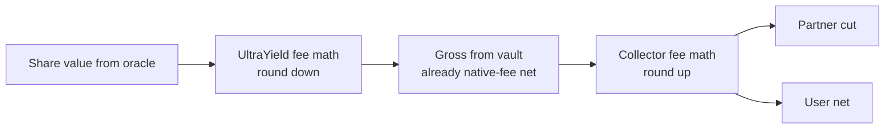

All asset-denominated arithmetic is in the asset's smallest units. No assumption of 18 asset decimals is made.
The WAD constants scale rates, not token balances.

### Oracle, base asset, and conversion dependencies

The collector fixes `i_asset` to `vault.asset()` in its constructor and uses that same base asset for deposits,
async requests, claims, and instant redemptions. It does not expose UltraYield's wider multi-asset selection to end
users, and every collector fee is paid in this base asset.

UltraYield obtains the current share price from its configured oracle. Share/asset conversion uses the oracle price
and rounds down:

```text
assets = floor(shares × sharePrice / 1e18)
shares = floor(assets × 1e18 / sharePrice)
```

UltraYield's rate provider is involved when a requested token differs from the base asset. Because this collector
always passes `i_asset == vault.asset()`, `convertToUnderlying` and `convertFromUnderlying` return the amount directly
and bypass the external rate-provider conversion. The oracle share price remains essential: it determines shares
minted on deposit, asset value on exit, management/performance fee bases, and fee shares minted.

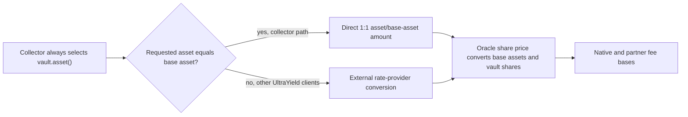

## Partner deposit fee

### Formula and ordering

On `deposit(assets, receiver)`, the collector:

1. rejects zero assets or a zero receiver;
2. queries the selected vault's `isAllowed` for both `msg.sender` (the funder) and `receiver` (the beneficiary);
3. transfers the full input from the funder to itself;
4. calculates and immediately transfers the partner deposit fee;
5. deposits only `assets - depositFee` into UltraYield;
6. receives the real UltraYield shares itself and credits those shares to the beneficiary's internal position.

The admission checks happen before either the user assets or the fee move. A rejected deposit cannot charge a fee.

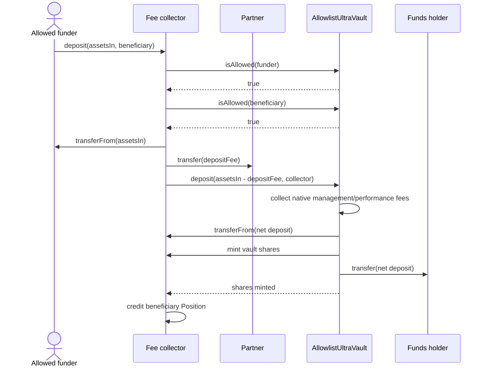

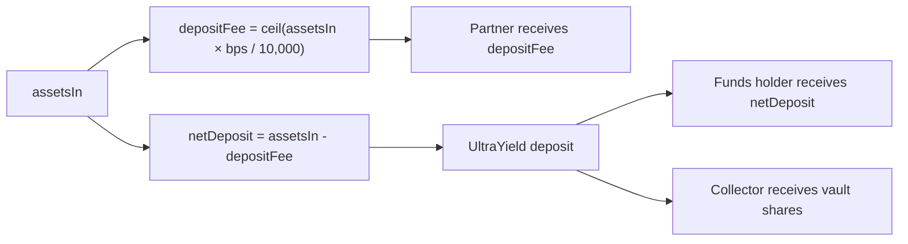

UltraYield itself does not charge a separate asset-denominated deposit fee. It does call `_collectFees()` immediately
before the deposit, so any accrued native management/performance fee is minted as shares before the new deposit is
priced and minted.

### Deposit recipients and KYC

The beneficiary does not receive vault shares. The collector does. This creates three independent admission facts:

- the collector explicitly requires both funder and beneficiary to return `true` from `isAllowed`;
- the collector itself must be allowlisted because `AllowlistUltraVault._update` gates the recipient of newly minted
  shares;
- the partner receives the underlying asset, not vault shares, so UltraYield's share allowlist does not gate the
  partner deposit-fee transfer.

The explicit collector checks call `isAllowed`, which reports membership, even if the vault owner has disabled
mandatory allowlist enforcement. As implemented, a funder and beneficiary still need membership for deposits
through the collector while the collector's own share receipt follows the vault's active enforcement switch.

## Position clock and AUM mechanics

### Active position

Each user has:

```solidity
struct Position {
    uint256 shares;
    uint256 lastBlock;
}
```

`lastBlock` is a synthetic, share-weighted acquisition block. It is not the last fee-payment block, and the
collector does not periodically settle AUM. AUM is deferred until assets exit.

For a first deposit:

```text
lastBlock = current block
```

For a top-up:

```text
newLastBlock = floor(
    (oldShares × oldLastBlock + newShares × currentBlock)
    / (oldShares + newShares)
)
```

The weighting uses **shares**, not deposited asset amounts. This makes the blended clock follow the quantity the
collector will later redeem. The integer division rounds the blended block down, which can add a fractional-block
equivalent of AUM in the partner's favor.

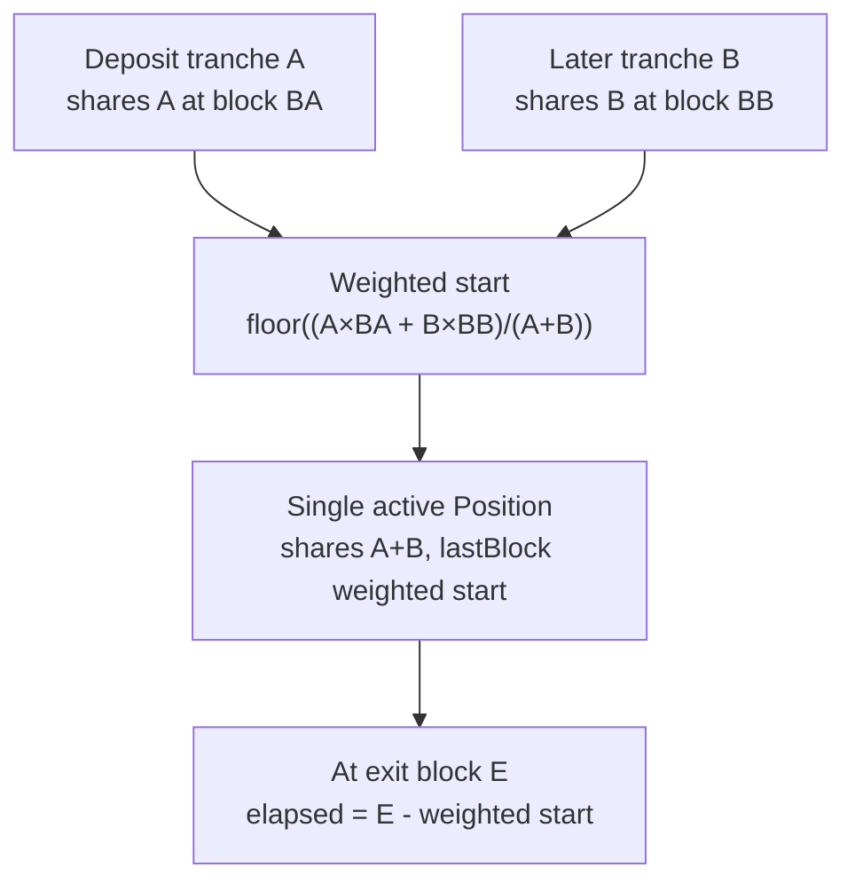

### What the AUM fee actually measures

The fee is not a time integral of the position's historical asset value. It uses:

- the asset amount returned for the particular exit;
- the current configured AUM rate at the time of settlement; and
- the number of blocks from the parcel's weighted start through the claim or instant-redeem transaction.

Consequences:

- yield or loss before exit changes the AUM fee because it changes `grossFromVault`;
- a partial exit is charged only on that exit's returned assets;
- the active remainder keeps its original `lastBlock` and therefore retains its full age;
- a requested async parcel carries its clock into pending state;
- time in the async queue, including time after fulfillment but before claim, continues to count;
- updating `aumFeePerBlock` applies the new rate to the entire elapsed interval of every existing active and pending
  position. Rates are not snapshotted or integrated by epoch.

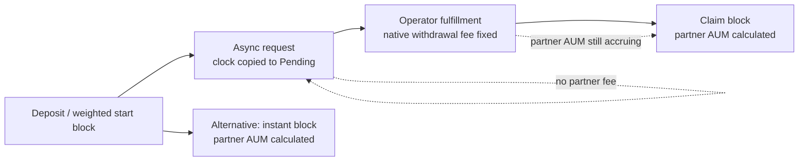

## Partner withdrawal fee and settlement clamp

Both exit routes use the same `_chargeAndPay` function. It receives the actual amount returned by UltraYield and
performs this sequence:

1. calculate the rounded-up partner withdrawal fee;
2. clamp it to gross assets (defensive; the configured 5% cap already keeps it below gross for positive gross);
3. calculate rounded-up raw AUM;
4. clamp AUM to `gross - withdrawalFee`;
5. transfer `withdrawalFee + aumFee` to the current partner;
6. transfer the exact remainder to the position owner.

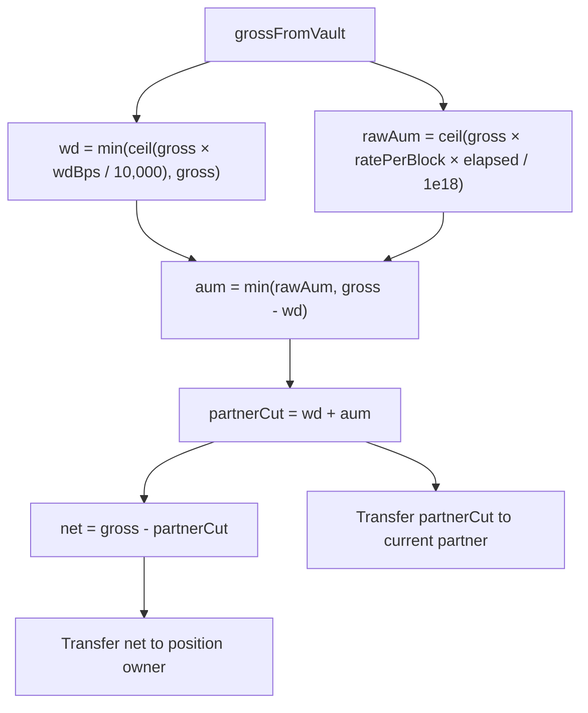

The clamp guarantees arithmetic cannot underflow and the sum of partner exit fees cannot exceed the amount the
collector received. It does **not** guarantee a positive user payout: after enough blocks at a high enough AUM rate,
the partner can receive the entire gross amount.

The withdrawal and AUM fee are additive, not sequential percentages. Both are calculated on the same
`grossFromVault`; AUM is not calculated after subtracting the withdrawal fee, except for the final cap.

## Async redemption: request, fulfillment, and claim

### Phase 1: request — no fee is paid

The user or partner moves shares from an active position into the user's pending position. The collector then calls:

```text
vault.requestRedeem(asset, shares, collector, collector, false)
```

The collector is both share owner and controller, and `autoClaim` is deliberately `false`. UltraYield transfers the
shares from the collector into vault escrow. No assets move and neither fee layer takes an exit fee at request time.

If the user already has pending shares, the pending `lastBlock` is blended by pending shares and the newly requested
shares, using the active position's `lastBlock` for the new parcel.

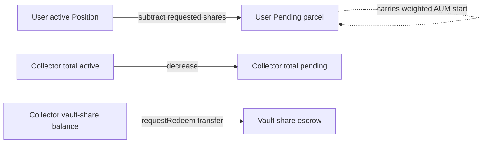

### Phase 2: operator fulfillment — UltraYield fee is paid

An UltraYield `OPERATOR_ROLE` account calls `fulfillMultipleRedeems`. UltraYield:

1. first collects accrued native management/performance fees as shares;
2. snapshots the oracle share price and native withdrawal-fee rate for the batch;
3. converts each fulfilled share amount to gross assets, rounding down;
4. calculates the native withdrawal fee, rounding down;
5. transfers that fee directly from the funds holder to the native fee recipient;
6. transfers only the post-fee assets from the funds holder into the vault;
7. changes the collector controller's accounting from pending to claimable;
8. burns the fulfilled escrowed shares.

Because `autoClaim=false`, fulfillment does not send assets to the collector or user.

### Phase 3: claim — partner fees are paid

The collector reads `vault.maxRedeem(collector)`, takes the smaller of that pooled claimable amount and the selected
user's pending shares, and calls `vault.redeem(toClaim, collector, collector)`. UltraYield transfers the claimable,
already-native-fee-net assets from the vault to the collector. The collector then applies partner withdrawal and AUM
fees and sends the remainder to the user.

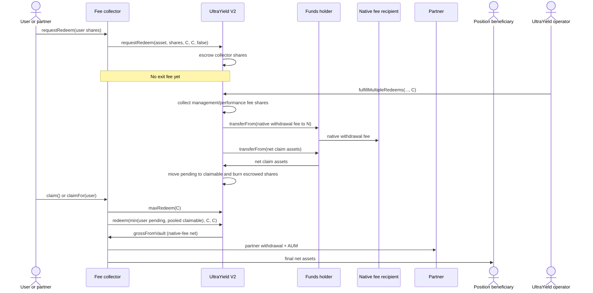

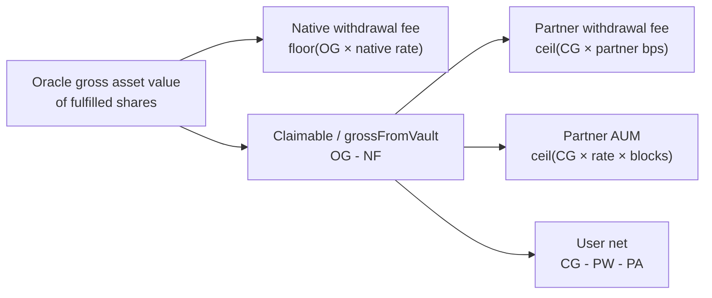

### Partial fulfillment and partial claim

If only part of a user's pending shares is fulfilled, `claim` consumes only the available portion. The pending
remainder keeps the same `lastBlock`; it does not reset at the first claim. Each claim calculates fees independently
on its own returned assets, and each rounded-up calculation can therefore create more aggregate rounding than one
combined claim.

UltraYield aggregates claimable assets and shares for the collector controller. A partial `redeem(shares, ...)`
receives:

```text
floor(shares × pooledClaimableAssets / pooledClaimableShares)
```

Redeeming every remaining claimable share receives every remaining asset unit, including accumulated rounding dust.
If the operator fulfilled the pool at different oracle prices or native withdrawal-fee configurations, the collector's
users therefore exit against the current pooled claimable asset/share ratio, not a preserved per-user fulfillment
lot. The collector then charges each user's partner fees on the asset amount actually returned for that claim.

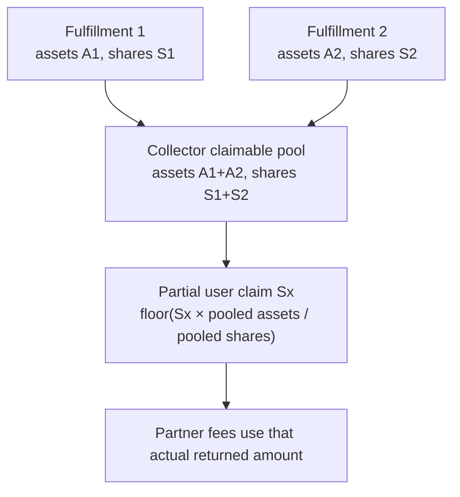

There is no collector method to cancel a request. UltraYield has operator cancellation machinery, but the collector
does not expose or reconcile it; normal collector operation assumes requested shares proceed through fulfillment and
claim.

## Instant redemption

Instant redemption is synchronous and depends on the vault's exitpoint balance and allowance. The available native
liquidity is:

```text
min(asset.balanceOf(exitpoint), asset.allowance(exitpoint, vault))
```

The collector's `getInstantLiquidity()` returns that gross vault liquidity. It is not a preview of a user's final
net, does not account for the user's share balance, and does not subtract either fee layer.

The instant flow is:

1. the collector subtracts shares from the user's active internal position;
2. it calls UltraYield `instantRedeem(asset, shares, 0, collector, collector)`;
3. UltraYield collects native management/performance fees as shares;
4. UltraYield values and burns the collector's shares;
5. the exitpoint pays the native withdrawal fee plus instant premium directly to the native fee recipient;
6. the exitpoint pays the remainder to the collector;
7. the collector charges partner withdrawal and AUM fees on that remainder;
8. the collector transfers final net assets to the user;
9. the collector verifies `net >= minNetToUser` and reverts the entire transaction if not.

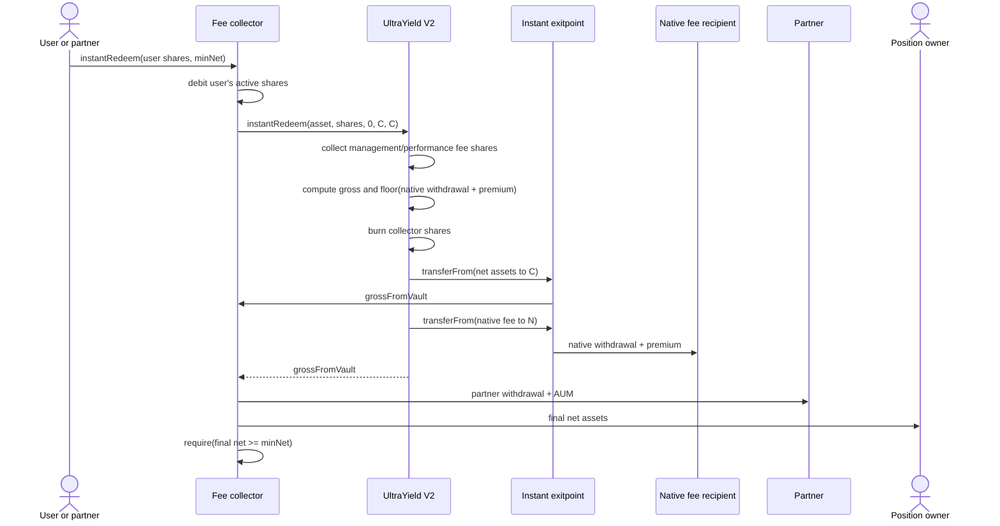

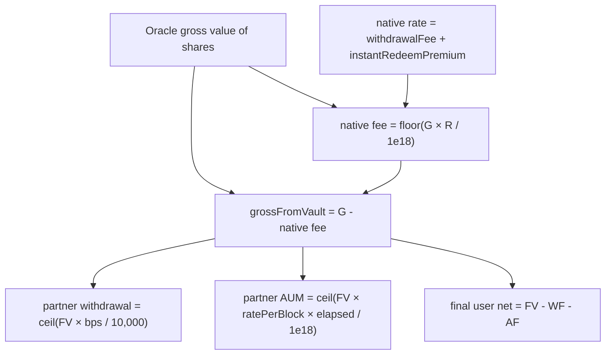

The collector deliberately passes zero for UltraYield's `minAssets` because the collector must protect the amount
after **both** fee layers, not merely UltraYield's intermediate payout. Its own `minNetToUser` is the final-net bound.
If that check fails, EVM atomicity rolls back the share debit and burn, the native fee transfer, the partner fee
transfer, and the apparent user payment.

## UltraYield management fee

The native management fee is annualized by timestamp, not by block:

```text
timePassed = block.timestamp - lastUpdateTimestamp
managementFeeAssets = floor(
    managementFeeRate × (snapshotTotalAssets × timePassed) / 31,536,000
) / 1e18
```

The implementation performs down-rounded integer arithmetic. `snapshotTotalAssets` is computed from total vault
shares and the current oracle share price. The asset-equivalent management fee is then combined with the performance
fee and converted to vault shares:

```text
feeShares = floor((managementFeeAssets + performanceFeeAssets) × 1e18 / sharePrice)
```

Those shares are minted to UltraYield's native fee recipient. No funds-holder asset transfer occurs for management
or performance fee collection.

## UltraYield performance fee and high-water mark

Performance fee accrues only when the current oracle share price exceeds the stored high-water mark:

```text
if sharePrice <= highwaterMark or performanceFeeRate == 0:
    performanceFeeAssets = 0
else:
    performanceFeeAssets = floor(
        performanceFeeRate
        × ((sharePrice - highwaterMark) × totalShares)
        / 10^(18 + vaultDecimals)
    )
```

`_setFees` preserves an existing high-water mark and seeds an empty one with `10 ** decimals()`. `_collectFees`
updates the stored high-water mark whenever the current share price is higher, even if the total calculated fee is
zero. A drawdown does not lower it.

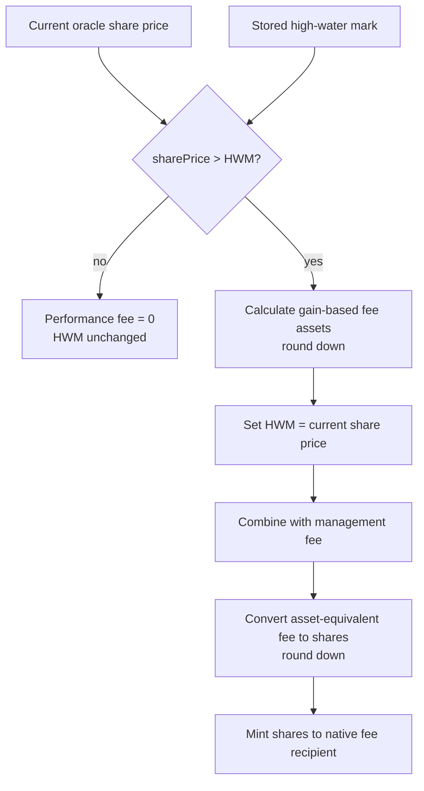

Management and performance fees dilute all pre-existing holders, including the collector. The collector's nominal
share balance does not decrease, but its fraction of total supply decreases when native fee shares are minted.

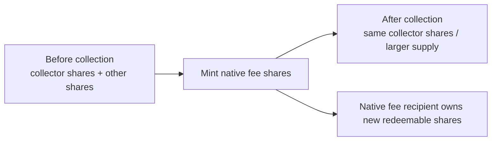

Native fee collection is triggered before UltraYield deposits/mints, instant redeems, and async operator fulfillment.
The UltraYield owner can also call `collectFees()`. `setFees` and a changing `setFeeRecipient` collect pending native
fees before applying the new configuration or recipient.

If total calculated management plus performance fee assets is zero, `_collectFees` does not update
`lastUpdateTimestamp`. If it is positive, the timestamp is updated before converting to shares. Because conversion
rounds down, a positive asset-equivalent fee can theoretically convert to zero shares while still advancing the
timestamp and emitting `FeesCollected` with zero shares.

Under `AllowlistUltraVault`, the native fee recipient must be eligible to receive vault shares while allowlist
enforcement is active. Otherwise the management/performance fee mint can revert and thereby block operations that
first call `_collectFees`.

## Native withdrawal fee and instant premium

UltraYield's native withdrawal fee is asset-denominated and separate from share-dilution fees.

For async fulfillment:

```text
grossAssets = down-rounded conversion of fulfilled shares at the fulfillment snapshot price
nativeWithdrawalFee = floor(grossAssets × withdrawalFeeRate / 1e18)
claimableAssets = grossAssets - nativeWithdrawalFee
```

For instant redemption:

```text
nativeInstantRate = withdrawalFeeRate + instantRedeemPremiumRate
nativeInstantFee = floor(grossAssets × nativeInstantRate / 1e18)
grossFromVault = grossAssets - nativeInstantFee
```

The instant fee rates are additive. The premium does not compound on top of the post-withdrawal-fee amount. Both
asset fees are transferred directly from their liquidity source to the native fee recipient.

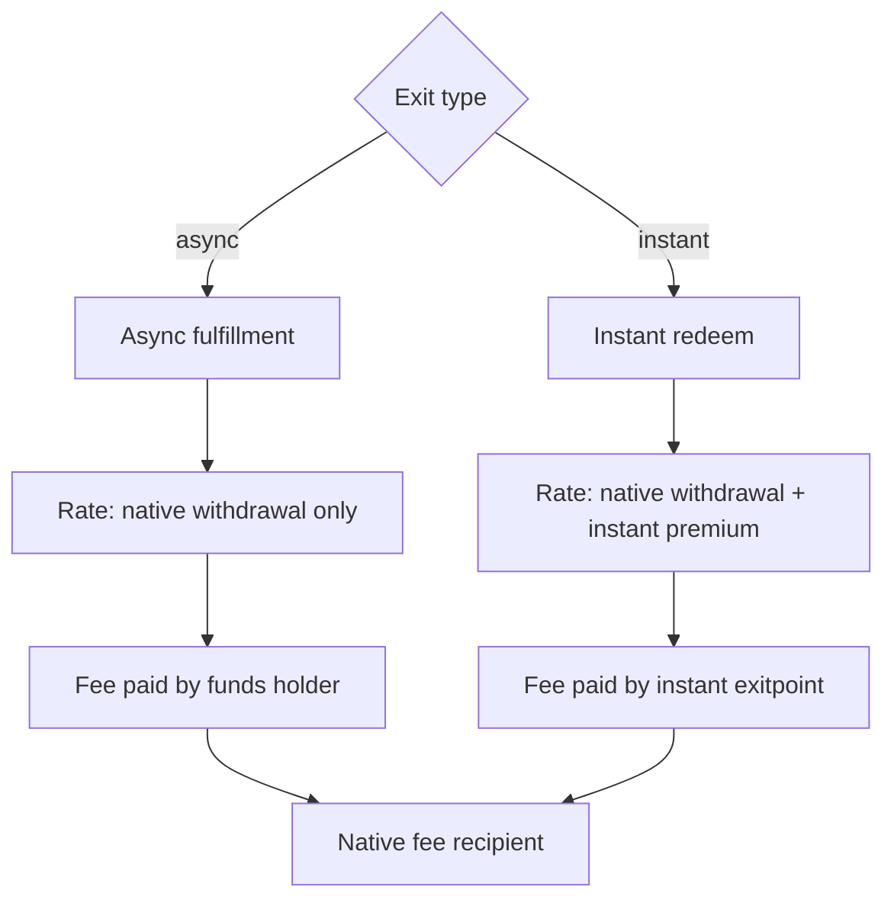

For async exits, the fee rate and share price are crystallized at operator fulfillment, not request or claim. For
instant exits, they are crystallized inside the instant transaction after native management/performance collection.

## Complete stacked fee equations

### Deposit

```text
D  = user input assets
dp = collector deposit bps

partnerDepositFee = ceil(D × dp / 10,000)
assetsInvested     = D - partnerDepositFee
sharesMinted       = UltraYield preview/deposit result after native fee collection
```

### Async exit

```text
S  = shares fulfilled and claimed
P  = UltraYield oracle share price at fulfillment
uw = UltraYield withdrawal WAD rate at fulfillment
pw = collector withdrawal bps at claim
pa = collector AUM WAD rate per block at claim
B  = claimBlock - pendingLastBlock

oracleGross        = floor(convert(S, P))
nativeFee          = floor(oracleGross × uw / 1e18)
grossFromVault     = oracleGross - nativeFee
partnerWithdrawal  = ceil(grossFromVault × pw / 10,000)
partnerAumRaw      = ceil(grossFromVault × pa × B / 1e18)
partnerAum         = min(partnerAumRaw, grossFromVault - partnerWithdrawal)
userNet            = grossFromVault - partnerWithdrawal - partnerAum
```

### Instant exit

```text
S  = shares instantly redeemed
P  = UltraYield oracle share price in the transaction
uw = UltraYield withdrawal WAD rate
ui = UltraYield instant-premium WAD rate
pw = collector withdrawal bps
pa = collector AUM WAD rate per block
B  = currentBlock - activeLastBlock

oracleGross        = floor(convert(S, P))
nativeFee          = floor(oracleGross × (uw + ui) / 1e18)
grossFromVault     = oracleGross - nativeFee
partnerWithdrawal  = ceil(grossFromVault × pw / 10,000)
partnerAumRaw      = ceil(grossFromVault × pa × B / 1e18)
partnerAum         = min(partnerAumRaw, grossFromVault - partnerWithdrawal)
userNet            = grossFromVault - partnerWithdrawal - partnerAum
```

The collector's exit percentage is therefore applied after the native percentage has reduced the base. It is not
equivalent to simply adding all displayed percentages and applying the sum once to oracle gross.

## Fee configuration lifecycle

### Collector administration

The collector owner can call `setFees` at any time, including while deposits are paused. New values are checked
against the hard caps and then replace all three old values together. There is no timelock, delayed activation,
per-user schedule, fee epoch, or grandfathering in the collector.

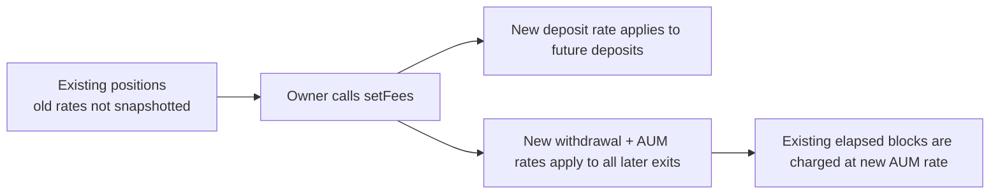

`setPartner` also takes effect immediately. Fees are never accrued into a collector-side claimable pool, so the new
partner receives only fees realized after the update. Historical fees already transferred to the old partner remain
there. The configured partner must be nonzero.

The partner has two roles at once:

- recipient of all collector fees; and
- authorized initiator of another user's request, claim, or instant exit.

A partner-driven exit can crystallize the configured fees without the user's transaction, but cannot redirect the
remaining assets: `_chargeAndPay` always transfers net to the internal position owner.

### UltraYield administration

UltraYield native rates and recipient are governed separately. Its owner:

- can set rates only within the native caps;
- must do so while UltraYield is unpaused;
- first collects pending management/performance fees under the old configuration;
- can change the fee recipient only to a nonzero address and first pays pending share fees to the old recipient;
- can call native `collectFees()` explicitly.

The collector owner has no direct authority over these native settings. Because the selected vault may be upgradeable,
fee behavior is also part of the vault-upgrade trust boundary.

## Pooled accounting and multi-user fairness

The collector maintains per-user active and pending ledgers, but UltraYield sees all users as one controller. The
important reconciliation model is:

```text
sum(user active shares)  = collector s_totalShares
sum(user pending shares) = collector s_totalPending

collector-held vault shares correspond to active shares
vault-escrowed/claimable shares correspond to pending shares as they move through UltraYield
```

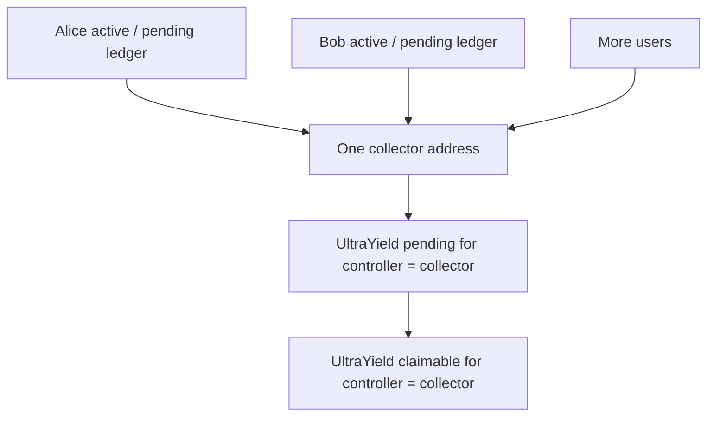

At claim, the collector uses `min(userPending, vault.maxRedeem(collector))`. Consequently, a user's claim can consume
pooled claimable capacity produced by fulfillment of the collector controller, up to that user's own pending balance.
Collector accounting prevents claiming more shares than that user has pending, but it does not preserve a native
claimable parcel identity per end user. Claims are effectively first-come-first-served against pooled fulfillment.

Because every user has their own `lastBlock`, partner AUM remains user-specific even though the underlying controller
is pooled. On partial claims the pending start is not reweighted or advanced.

## Pause, allowlist, and restriction interactions

### Collector pause

The collector's `Pausable` guard applies only to `deposit`. Async request, claim, and instant-redeem collector methods
remain callable when the collector is paused. The intent is to stop inflows without trapping existing positions.

### UltraYield pause

UltraYield's async request and claim paths are designed to work while the vault is paused; instant redemption is
guarded by UltraYield's `whenNotPaused`. Native owner fee administration is also unpaused-only. Thus a collector pause
and a vault pause have different meanings.

### Allowlist

```mermaid
flowchart TD
    D["Collector deposit requested"]
    F{"vault.isAllowed(funder)?"}
    B{"vault.isAllowed(beneficiary)?"}
    C{"Can vault mint shares to collector?"}
    OK["Deposit and partner deposit fee proceed"]
    NO["Revert before moving assets or charging fee"]

    D --> F
    F -- "no" --> NO
    F -- "yes" --> B
    B -- "no" --> NO
    B -- "yes" --> C
    C -- "no" --> NO
    C -- "yes" --> OK
```

Allowlist membership is checked only for deposits. A user removed after depositing may still request, claim, or
instantly redeem, so removal does not waive fees and does not trap the position. The collector receives exit assets
as the UltraYield controller/receiver and then transfers ordinary ERC-20 assets to the user.

`AllowlistUltraVault` has separate rules for vault-share destinations and asset receivers. Mints of native fee shares
to the native fee recipient and deposit shares to the collector must pass its share-receiver rule. The collector's
partner and end-user asset transfers occur outside the vault-share token and are not gated by `isAllowed`.

UltraYield also has blocklist/freeze compliance restrictions distinct from the deposit allowlist. Those vault-level
checks can affect interactions where the collector is the UltraYield receiver/controller even though the collector's
own deposit hook only queries `isAllowed`.

## Failure behavior and atomicity

All public collector paths that move user assets or position shares are `nonReentrant`. Administrative setters do not
move user funds and do not carry that modifier. Asset and share operations use `SafeERC20`, including `forceApprove`
during construction. The collector grants:

- maximum underlying-asset allowance to the selected vault for deposits; and
- maximum vault-share allowance to the vault itself because V2 `requestRedeem` spends the owner's allowance before
  transferring shares into escrow.

The following fee-relevant failures revert the whole transaction:

| Failure | Result |
|---|---|
| Funder or beneficiary not allowed | No asset transfer and no deposit fee |
| Collector itself not accepted as share receiver | Entire deposit, including partner fee transfer, rolls back |
| Fee configuration above a collector cap | No rate changes |
| UltraYield fee configuration above a native cap | No native rate changes |
| No async claimable shares | No partner fee and no pending-state change |
| Insufficient instant liquidity | No share burn or fee payment |
| Final instant net below `minNetToUser` | Both fee layers' transfers and all accounting roll back |
| Partner/user asset transfer fails | Entire exit settlement rolls back |
| Native fee-share recipient cannot receive shares | Native collection and the triggering vault operation revert |
| Oracle/rate-provider conversion reverts | No fee or position transition survives |

```mermaid
flowchart LR
    CALL["One collector transaction"]
    S1["Internal accounting changes"]
    S2["UltraYield burn / fulfillment / payout"]
    S3["Native fee transfer"]
    S4["Partner fee transfer"]
    S5["User net transfer"]
    CHECK{"All calls and slippage checks pass?"}
    COMMIT["Commit all effects"]
    REVERT["Revert all effects"]

    CALL --> S1 --> S2 --> S3 --> S4 --> S5 --> CHECK
    CHECK -- "yes" --> COMMIT
    CHECK -- "no" --> REVERT
```

## Views, events, and observability

### Collector views

| View | Fee interpretation |
|---|---|
| `getDepositFeeBps()` | Current rate, not a user's historical deposit rate |
| `getWithdrawalFeeBps()` | Current rate that will apply to the next settlement |
| `getAumFeePerBlock()` | Current rate that will apply to all elapsed blocks at the next settlement |
| `getPartner()` | Current fee recipient and authorized `*For` caller |
| `getPosition(user)` | Active shares and weighted AUM start block |
| `getPending(user)` | Requested shares and their weighted AUM start block |
| `getPositionValue(user)` | `convertToAssets(activeShares)` before all exit fees; excludes pending shares |
| `getInstantLiquidity()` | Gross exitpoint liquidity exposed by UltraYield; not final user net |

There is no collector preview function that combines native and partner fees. An integration should use UltraYield's
preview/price information for the intermediate payout, apply the current collector formulas, and still supply
`minNetToUser` because state can change before execution.

### Collector events

| Event | Important fields |
|---|---|
| `CuratedFeeCollector__FeesSet` | The complete new partner rate tuple |
| `CuratedFeeCollector__PartnerSet` | New collector fee recipient |
| `CuratedFeeCollector__Deposited` | Beneficiary, full assets in, realized partner deposit fee, shares credited |
| `UltraYieldV2FeeCollector__RedeemRequested` | User, actual caller, shares, V2 request ID |
| `CuratedFeeCollector__Withdrawn` | User, actual caller, shares, gross from vault, partner withdrawal fee, partner AUM fee, final net |
| `UltraYieldV2FeeCollector__InstantRedeemed` | User, caller, shares, gross from vault, final net |

`Withdrawn` is emitted for both async claims and instant exits and is the authoritative collector fee breakdown.
The instant-specific event adds route identification but does not repeat the two partner fee components.

### UltraYield events

| Event | Fee meaning |
|---|---|
| `FeesUpdated` | Old and new native fee structures, including timestamp and high-water mark |
| `FeesRecipientUpdated` | Native fee-share/asset recipient change |
| `FeesCollected` | Native fee shares minted and management/performance asset equivalents |
| `WithdrawalFeeCollected` | Native async asset fee transferred |
| `InstantRedeem` | Controller, receiver, asset, shares, native-fee-net assets, combined native instant fee |
| ERC-4626 `Deposit` / `Withdraw` | Standard vault movement; instant `Withdraw` records the native-fee-net asset amount |

Indexers should correlate both contracts' events to reconstruct the whole fee stack. No single event reports deposit,
native fees, partner exit fees, and final user economics together.

## User stories and use cases

### 1. User deposits for themself

An allowlisted user approves the collector and deposits. The partner immediately receives the deposit fee. UltraYield
receives only the remainder, mints shares to the allowlisted collector, and forwards deposited capital to the funds
holder. The user owns an internal position starting at that block.

### 2. Allowed funder deposits for an allowed beneficiary

The funder pays the assets and deposit fee; the beneficiary receives the internal position. Both must be members of
the selected vault's allowlist. A compliant funder cannot create a position for an unapproved beneficiary, and an
approved beneficiary cannot accept funds from an unapproved funder through this path.

### 3. User chooses the async route

The user requests some or all active shares. No exit fee is paid yet. The operator later fulfills, paying UltraYield's
native withdrawal fee from the funds holder. At claim, the partner gets withdrawal plus AUM fees and the user receives
the remainder. The user accepts queue latency in exchange for not paying the native instant premium.

### 4. User chooses the instant route

The user exits immediately when the exitpoint has enough balance and allowance. They pay UltraYield's native
withdrawal fee and instant premium, then the partner withdrawal and AUM fees. `minNetToUser` protects the final result.

### 5. Partner performs an operational exit

The current partner may request/claim or instantly redeem for a user. This supports custody and managed-exit workflows.
It also means the partner can decide when an exit fee crystallizes. The net assets remain hardwired to the position
owner, not the partner or caller.

### 6. User is removed from the allowlist after deposit

New deposits involving that user fail, but existing async and instant exits remain available at the collector layer.
The usual native and partner fees still apply. This is an exit-safe KYC policy, not a fee waiver.

### 7. Multiple users share one collector

Their active and pending shares remain separated in collector storage, but fulfillment is pooled under the collector's
UltraYield controller address. A user can claim only up to their own pending shares; available native claimable shares
are consumed in claim order.

### 8. Fee rates or partner change while a position is open

The next deposit uses the then-current deposit rate. The next exit uses the then-current withdrawal rate and applies
the then-current AUM rate to all elapsed blocks. The then-current partner receives the realized fees. No snapshot
protects an existing position from changes.

### 9. Zero-fee configuration

Any collector rate may be zero. Zero deposit fee sends the full input to UltraYield; zero withdrawal or AUM fee omits
that transfer component. Native UltraYield fees remain independent and may still apply.

### 10. Very old position or aggressive AUM setting

Raw AUM may exceed the exit proceeds. The clamp gives the partner the assets left after the withdrawal fee and gives
the user zero. The transaction remains arithmetically valid.

## Worked examples

The following examples use a six-decimal stablecoin only for readability. The formulas are decimal-agnostic.

### Deposit, then async exit

Assume:

- deposit: 100,000 units;
- partner deposit fee: 1%;
- partner withdrawal fee: 0.5%;
- partner AUM rate: `1e9` WAD per block;
- elapsed blocks at claim: 1,000,000;
- no native withdrawal fee in this numerical example;
- no change in the 99,000 assets invested.

```text
partner deposit fee = 100,000 × 1% = 1,000
assets invested      = 99,000
gross from vault     = 99,000
partner withdrawal   = 99,000 × 0.5% = 495
AUM fraction         = 1e9 × 1,000,000 / 1e18 = 0.1%
partner AUM          = 99,000 × 0.1% = 99
final user net       = 99,000 - 495 - 99 = 98,406
```

The partner receives 1,000 at deposit and 594 at claim. Any native withdrawal fee would first reduce
`gross from vault`, and the 0.5% and 0.1% partner charges would use that reduced amount.

### Deposit, then instant exit with native premium

Use the same 100,000 deposit and 1% deposit fee, then assume:

- oracle gross at instant exit: 99,000;
- combined native withdrawal plus premium: 0.5%;
- partner withdrawal: 0.5%;
- partner AUM rate: `1e9` per block;
- elapsed blocks: 250,000.

```text
native instant fee   = floor(99,000 × 0.5%) = 495
gross from vault     = 99,000 - 495 = 98,505
partner withdrawal   = ceil(98,505 × 0.5%) = 492.525
AUM fraction         = 1e9 × 250,000 / 1e18 = 0.025%
partner AUM          = ceil(98,505 × 0.025%) = 24.62625
final user net       = 98,505 - 492.525 - 24.62625 = 97,987.84875
```

The native fee recipient receives 495 from the exitpoint. The partner receives 517.15125 at exit, in addition to the
1,000 deposit fee collected earlier.

## What is deliberately not implemented in the collector

To avoid confusing the collector with UltraYield's richer native model, the collector has no:

- partner performance fee or partner high-water mark;
- timestamp-based partner management fee;
- fee shares, fee vault, deferred partner-fee pool, or partner `collectFees()` operation;
- per-user rate tier, immutable quote, signed fee authorization, or rate snapshot;
- transferable user receipt/share token;
- fee refund on early exit, failed strategy performance, or allowlist removal;
- fee exemption for the partner, owner, funder, beneficiary, or delisted user;
- separate AUM settlement on top-up, request, or fulfillment;
- compounding of withdrawal fee and AUM fee;
- automatic reservation of instant liquidity;
- user-specific UltraYield controller or user-specific native claimable parcel;
- collector-level async cancellation/reconciliation flow;
- hardcoded UltraYield deployment address.

UltraYield does have native performance and management fees, a high-water mark, fee-share minting, and explicit fee
collection. Those mechanisms belong to the native layer and remain economically active underneath the collector.

## Integration evidence

The Foundry live-fork suite exercises the collector against the deployed UltraYield V2 proxy at
`0x02f4301b684600129913B66aEf9BE2c230a3BcAd` at pinned mainnet block `25,485,000`, without `vm.mockCall` or protocol
redeployment. It uses the deployed vault's real allowlist, funds-holder, exitpoint, request, fulfillment, claim, and
instant-redeem code. The tests cover:

- vault-admin onboarding of the collector;
- rejected funder/beneficiary/collector admission without fee leakage;
- exact partner deposit fee and funds-holder receipt;
- exact partner withdrawal and AUM fees on async claim;
- native instant fee plus partner fee stacking;
- partial fulfillment and repeated claims;
- multiple users behind one pooled controller;
- partner-driven exits with principal delivered to the user;
- successful async and instant exits after user allowlist removal;
- final-net slippage rollback; and
- fee arithmetic rounding and monotonic AUM properties.

The fork address is test evidence only. Production may use a different compatible `AllowlistUltraVault` proxy supplied
to the collector constructor.

## Fee-relevant code map

| Source | Responsibility described here |
|---|---|
| [`contracts/UltraYieldV2FeeCollector.sol`](../contracts/UltraYieldV2FeeCollector.sol) | V2 KYC hook, active-to-pending transitions, async claims, instant exits |
| [`contracts/CuratedFeeCollectorBase.sol`](../contracts/CuratedFeeCollectorBase.sol) | Partner configuration, deposits, position clock, common exit fee split |
| [`contracts/libraries/FeeMath.sol`](../contracts/libraries/FeeMath.sol) | Rounded-up bps and per-block AUM calculations |
| [`contracts/interfaces/IUltraVaultV2.sol`](../contracts/interfaces/IUltraVaultV2.sol) | Minimal V2 surface used by the collector |
| [`lib/ultrayield-v2-src/vaults/UltraVault.sol`](../lib/ultrayield-v2-src/vaults/UltraVault.sol) | Native fees, oracle valuation, fulfillment, instant liquidity and payout |
| [`lib/ultrayield-v2-src/vaults/BaseControlledAsyncRedeem.sol`](../lib/ultrayield-v2-src/vaults/BaseControlledAsyncRedeem.sol) | Deposit custody, request escrow, claim and controller access |
| [`lib/ultrayield-v2-src/utils/RedeemQueueLib.sol`](../lib/ultrayield-v2-src/utils/RedeemQueueLib.sol) | Pooled pending/claimable accounting and pro-rata claim rounding |
| [`lib/ultrayield-v2-src/interfaces/Types.sol`](../lib/ultrayield-v2-src/interfaces/Types.sol) | Native `Fees`, pending, and claimable structures |
| [`test/ultrayield_v2/UltraYieldV2FeeCollector.t.sol`](../test/ultrayield_v2/UltraYieldV2FeeCollector.t.sol) | Live mainnet-fork behavior and stacked-fee assertions |
| [`test/unit/FeeMath.t.sol`](../test/unit/FeeMath.t.sol) | Unit and fuzz properties for partner arithmetic |

## End-to-end lifecycle summary

```mermaid
stateDiagram-v2
    [*] --> NoPosition
    NoPosition --> Active: allowed deposit / partner deposit fee
    Active --> Active: top-up / weighted AUM start
    Active --> Pending: async request / no exit fee
    Pending --> Pending: partial operator fulfill / native withdrawal fee
    Pending --> Claimable: final operator fulfillment
    Claimable --> Claimable: partial claim / partner withdrawal + AUM
    Claimable --> Exited: final claim / partner withdrawal + AUM
    Active --> Exited: instant redeem / native withdrawal + premium / partner withdrawal + AUM
    Active --> Active: partial instant redeem / remainder keeps start block
    Exited --> [*]
```

In one sentence: the collector skims a rounded-up partner fee before investing, holds pooled UltraYield shares behind
per-user internal accounting, lets UltraYield realize its own native economics first, and then skims rounded-up partner
withdrawal and block-based AUM fees from the actual exit proceeds before sending the exact remainder to the user.
